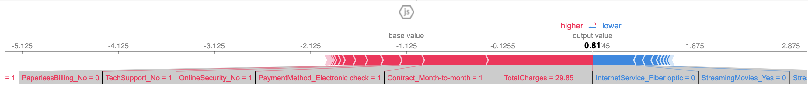
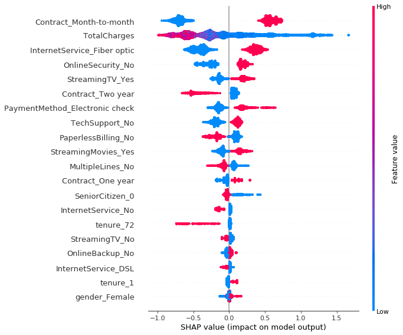
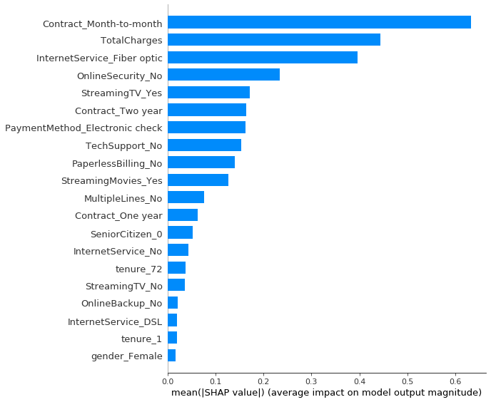

# Telecom Customer Churn Prediction
## Project Core Objectives
1. Trained mutiple machine learning models in Python Notebook to predict customer churn for the TelCom Company.
2. Programmed a Auto-Machine Learning model using H20 and compared the model performance (in terms of recall and accuracy) againts models trained in Python.
3. Tested casual inference on following predictors: gender, SeniorCitizen, Partner, Dependents, PhoneService, and PaperlessBilling by applying Microsoft DoWhy pakacage realized in Python.             
4. Assembled a model interpretability and explainability analysis using SHAP package on XGBoost Classification Model.
5. Composed a Machine Learning Bias Report based on the SHAR analysis to suggest further managerial actions.
6. Lessons learned and next steps

## Busniess Context - Jiajun
### Problem Definition
### Current Situation
### Objectives and Benefits
### Hypothesis
What can be predicted / optimized
What are the actions can be taken?
What are the possible outcomes
Null hypothesis
Outcomes and types of errors

## Data Source Report - someone?

## Churn Prediction Modeling
### Python-based Model -dev
Model Work Flow:
1. get data and descriptive stats
2. data visualization 
3. train a model:
    1) Regression;
    2) ANN;
    3) Random Forest;
    ...
4. select model and further tune
5. Extra
    1) building a pipeline
    ...... 
### H20 Auto-ML Model -everlyn

## Model Results 
### Results Summary Report-- everlyn?

### Churn Model Interpretability and Explainability Report -- Jiajun
To access the XGBoost Classification Model interpretability and explainability, we used the SHAR package to visualize the predictors' effect on the target variable, churn. The reason we choose the XGBoost Classification Model to analyze instead of the Random Forest Model because the Random Forest Model takes significantly longer compared to the XGBoost Model, and our team's laptops are unable to provide the results. 

We first can to visualize the first prediction's explanation:

Next, we summarize the effects of all the features:

We can also just take the mean absolute value of the SHAP values for each feature to get a standard bar plot (produces stacked bars for multi-class outputs):

## Conclusions
### Overall Conclusion
### XGBoost Classification Model Bias Report -- Jiajun
### Next Step 
