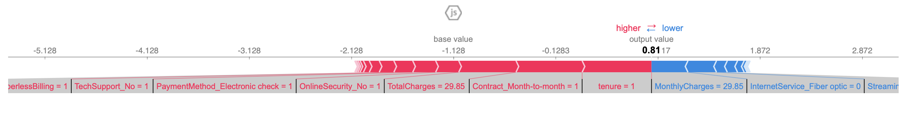
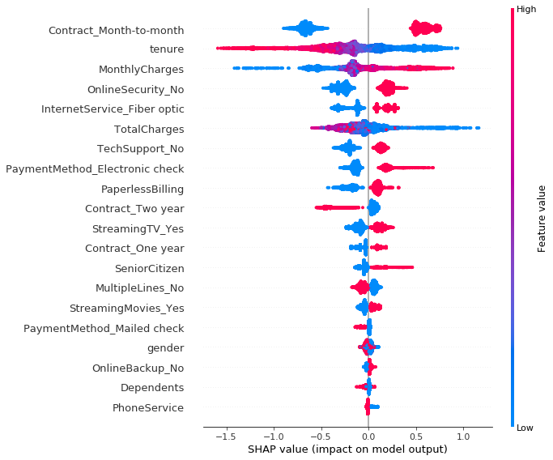

# TelCo Customer Churn Prediction

## Problem Definition, Current State, Objectives and Benefits
The core objective is predicting customer churn behavior for the TelCo Company. TelCo Company currently has no data-driven and quantitatively-based prediction model. Our team will develop machine learning models, using a 7043-observation (customer) with 20 predictors dataset. The model will be a supervised, binary classification model, since we have a clear binary target variable, churn or no churn. To achieve the optimal outcome, our team will both manually build machine learning models in Python and develop an Auto Machine Learning Model in H20.ai. The core performance will be measured in terms of the Recall Score. Because the underlying assumption is that TeleCo wants to minimize customer churn rate. To do so, the best model used will be the one that maximized the recall score. 

After the optimal model was chosen and picked, it will be run offline periodically (at most once a day). In other words, the prediction model will build on a batch processing system using Apache Spark, which takes a large amount of input data, runs the pickled prediction model to process it, and produces the prediction outcome. The minimum performance needed for the model is that the recall score is higher than 0.5. Another assumption is that TeleCo has millions of consumers. Therefore, even a marginal improvement from 0.5, such as 0.01 increase, will provide a significant increase in customer retention, revenue, and net operating income. 

Our model will be used by the marketing and consumer retention team so that they could intervene early by either offering targeted online offers and coupons, or having representatives phoning those consumers who are predicted to churn. Also, the model explainability report will be used by middle-level managers to gain insights on the factor that both positively and negatively contribute to the churn rate so they could address such factors accordingly. 

## Project Core Objectives/Hypothesis
### Prediction Task:
Predicting (i.e., classifying) wheather a current customer will churn from TelCo or not.

### Null Hypothesis and Types of Errors:
H0(Null Hypothesis): The recalll score is less or equal to 0.5 and no predicting power can be generated from the model. 

Ha(Alternative Hypothesis): The recalll score is greater than 0.5 and some predicting power can be generated from the model.

Types of Erros: Both Type I and Type II errors are expected to be made by the model. The goal of the model is to minimize Type II errors (i.e., reducing false negative rate.)    

### Core Tasks/Actions:
1. Trained multiple Python-based Machine Learning models to predict customer churn for the TelCo Company.
2. Programmed a H20.ai-based Auto Machine Learning model and compared the AutoML model performance (in terms of recall and accuracy) against manually trained models.
3. Tested causal inference on following predictors: gender, SeniorCitizen, Partner, Dependents, PhoneService, and PaperlessBilling by applying Microsoft DoWhy package realized in Python.             
4. Assembled a model interpretability and explainability analysis using SHAP package on XGBoost Classification Model.
5. Composed a Machine Learning Bias Report based on the SHAR analysis to suggest further managerial actions.
6. Lessons learned and next steps

## Data Description Report - someone?
Be sure including the following: 
Document and present leveraged data sources used to create the dataset
• Cover a brief resume of 5.2. Data Acquisition, 5.3. Data Exploration, and 5.4.
Data Preparation
• Profile and present the data before and after going through acquisition, exploration, and preparation.
5.2. Data Acquisition
• List the data you need and how much you need.
• Find and document where you can get that data.
• Check how much space it will take.
• Check legal obligations, and get authorization if necessary.
• Get access authorizations.
• Create a workspace (with enough storage space).
• Get the data.
• Convert the data to a format you can easily manipulate (without changing the data itself).
• Ensure sensitive information is deleted or protected (e.g. anonymized).
• Check the size and type of the data (time series, sample, geographical, etc.)
• Sample a test set, put it aside, and never look at it (no data snooping!).
5.3. Data Exploration
• Create a copy of the data for exploration (sampling it down to a manageable size if necessary).
• Create a Jupyter notebook to keep a record of your data exploration.
• Study each attribute and its characteristics:
• Name
• Type (categorical, int/float, bounded/unbounded, text, structured, etc.)
• % of missing values
• Noisiness and type of noise (stochastic, outliers, rounding errors, etc.)
• Possibly useful for the task?
• Type of distribution (Gaussian, uniform, logarithmic, etc.)
• For supervised learning tasks, identify the target attribute(s).
• Visualize the data.
• Study the correlations between attributes.
• Study how you would solve the problem manually.
• Identify the promising transformations you may want to apply.
• Identify extra data that would be useful (go back to “Get the Data”).
• Document what you have learned.
5.4. Data Preparation
1. Dealing with missing data 
2. Cleaning data
3. Data preprocessing
4. Feature subset selection 
5. Feature engineering
6. Feature scaling 
7. Clustering
refer here: https://www.kaggle.com/blastchar/telco-customer-churn

## Churn Prediction Modeling
### Python-based Model -dev

Model Work Flow:
1. get data and descriptive stats
2. data visualization 
3. train a model:
    1) Regression;
    2) ANN;
    3) Random Forest;
    ...
4. select model and further tune
5. Extra
    1) building a pipeline
    ...... 
### H20 Auto-ML Model 

H2O’s AutoML can be used for automating the machine learning workflow, which includes automatic training and tuning of many models within a user-specified time-limit. It has made it easy for non-experts to experiment with machine learning to set a benchmark. 

We have used H2O package to build models to compare the results with our Python-based model. 

Due to the limited available algorithms at this stage of H2O, we were only able to perform Random Forest and Gradient Boosting to compare with our Python-based model. However, we also explored deep learning , and asked H2O to self-select 10 best performing models. 

​																Table xx. H2O AutoML Model Results

| Model             | Accuracy Score | F1 Score |
| ----------------- | -------------- | -------- |
| Random Forest     | 0.8272         | 0.6308   |
| Gradient Boosting | 0.8346         | 0.6272   |
| Neutral Network   | 0.8257         | 0.6193   |

​									Table xx. 10 Best Performing Models Selected by H2O AutoML

| model_id                                            | auc      | mse      |
| --------------------------------------------------- | -------- | -------- |
| StackedEnsemble_BestOfFamily_AutoML_20200216_115946 | 0.850544 | 0.133636 |
| StackedEnsemble_AllModels_AutoML_20200216_115946    | 0.850509 | 0.133678 |
| GBM_5_AutoML_20200216_115946                        | 0.848467 | 0.13321  |
| GLM_1_AutoML_20200216_115946                        | 0.847801 | 0.133984 |
| GBM_grid__1_AutoML_20200216_115946_model_1          | 0.842607 | 0.148619 |
| GBM_1_AutoML_20200216_115946                        | 0.841779 | 0.136873 |
| GBM_2_AutoML_20200216_115946                        | 0.841048 | 0.136614 |
| GBM_3_AutoML_20200216_115946                        | 0.838457 | 0.138417 |
| DeepLearning_1_AutoML_20200216_115946               | 0.83469  | 0.13864  |
| GBM_4_AutoML_20200216_115946                        | 0.832629 | 0.140648 |
| XRT_1_AutoML_20200216_115946                        | 0.832395 | 0.140071 |
| DRF_1_AutoML_20200216_115946                        | 0.828687 | 0.141467 |

## Model Results 

### Results Comparison of Python-Based Models and H2O AutoML

​																Figure 1. Model Result Comparison
### Casual Inference Report --Charlie?

### Churn Model Interpretability and Explainability Report
To access the XGBoost Classification Model interpretability and explainability, we used the SHAR package to visualize the predictors' effect on the target variable, churn. SHAP (SHapley Additive exPlanations) is a game theoretic approach to explain the output of any machine learning model. The reason we choose the XGBoost Classification Model to analyze instead of the Random Forest Model because the Random Forest Model takes significantly longer compared to the XGBoost Model, and our team's laptops are unable to provide the results. 

We first can to visualize the first prediction's explanation:

Next, we summarize the effects of all the features. The plot below sorts features by the sum of SHAP value, and uses SHAP values to show the distribution of the impacts each feature has on the model output. A higher feature value is colored in red and a lower feature value is colored in blue. 

Here are some sample interpretations: 
1. If a consumer is on a month to month contract (red-colored), it is more likely to churn.
2. The longer a consumer is with the company (higher red-colored for tenure), it is less likely to churn.
3. If a consumer's monthly charges are high, it is more likely to churn.
4. On the other hand, if the total charges are high, it is less likely to churn. This could imply that for high spenders at TelCo, these consumers are less price sensitive. 
5. If a consumer is a senior citizen, it is more lily to churn.

We can also just take the mean absolute value of the SHAP values for each feature to get a standard bar plot (produces stacked bars for multi-class outputs):

## Threats to validity - someone?
### Uncertainties and Risks
### Data quality issues

## Conclusions 
### Overall Thought

### Model Bias Report 
There are four predictors used in the model that may be considered as potential biased or discriminatory, namely, gender, senior citizen (i.e., whether the customer is a senior citizen or not), partner (i.e., whether the customer has a partner or not), and dependents (whether the customer has dependents or not). Based on the Gini coefficients report and summarization effects of all the features, only senior citizens and gender show a high degree of effects on model prediction outcome. This implies that we can still keep partners and dependents in our model without worrying about model bias. Regarding gender, the predictor's effect has a low feature value and low mean absolute SHAP values. Hence, by dropping the gender from the model, not only can we prevent any potential model bias, but also the adverse effects on the model performance by dropping the predictor is lowest. If we drop the predictor, we may lose significant predicting power. Additionally, age or date of birth predictors is widely used in machine learning models such as credit card approval and insurance underwriting. Hence, we would recommend keeping the senior citizen predictor.

### Next Step
Our team would recommend the marketing analysis at the TelCo continue to investigate the model interpretability report, to identify churn correlations or causes, and to address the issues accordingly. For example, our team has found that if a consumer is with a two-year phone contract, then that consumer is less likely to churn. Hence, the TelCo marketing team could offer better new two-year deals to attract new customers to sign-up for a new two-year contract. However, some factors that contribute to the prediction outcome are not immediately apparent. For example, our team has discovered that if a consumer signed up for paperless billing, it is more likely to churn. The TelCo team cannot derive action such as stop all paperless billing based on the report alone. Instead the TelCo team should deep dive into the causal inference report and discover the unobserved factors, for example, what types of people are more likely to sign-up for paperless billing.  
